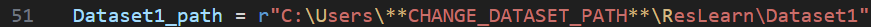

# ResLearn: Transformer-based Residual Learning for Metaverse Network Traffic Prediction
Initial development of VR Network Traffic Prediction

# Running `pred_xr.py`
- Ensure appropriate dataset files are in repository

  
- Modify `config.py` to point to appropriate dataset paths (MUST BE FULL PATH)

    
- Install Anaconda dependencies from `environment.yaml` file
  ```bash
  conda env create --file environment.yaml
  conda activate myenv
  ```
---
### Entry point `python pred_xr.py` plus flags
### All possible flags with default options
  ```bash
  python pred_xr.py --data Dataset1 --feature frame_size --experiment 1 --residual_learning 0 --model lstm
  ```
### `--data`
- **Description**: Specifies the dataset to be used.
- **Default**: `Dataset1`
- **Options**: `Dataset1` `Dataset2` `Dataset3`
- **Usage**:
  ```bash
  python pred_xr.py --data Dataset2
### `--feature`
- **Description**: Specifies the segment type to be used.
- **Default**: `frame_size`
- **Options**: `frame_size` `frame_count` `frame_iat`
- **Usage**:
  ```bash
  python pred_xr.py --feature frame_size
### `--experiment`
- **Description**: Specifies the experiment number.
- **Default**: `1`
- **Options**: `1` `2` `3` `4` `5` `6`
- **Usage**:
  ```bash
  python pred_xr.py --experiment 2
### `--residual_learning`
- **Description**: Includes residual learning.
- **Default**: `0`
- **Options**: `1` (True) or `0` (False)
- **Usage**:
  ```bash
  python pred_xr.py --residual_learning 1
### `--model`
- **Description**: Chooses the model to be used.
- **Default**: `lstm`
- **Options**: `lstm` `stacked_lstm` `transformer` `gru` `cnn_lstm` `ensemble`
- **Usage**:
  ```bash
  python pred_xr.py --model lstm
---
### Flags that don't run segmentation
### `--clean`
- **Description**: Deletes folders `["metrics", "plots", "models", "predicted"]`.
- **Default**: `False` (0)
- **Options**: `True` (1) or `False` (0)
- **Usage**: 
  ```bash
  python pred_xr.py --clean 1
### `--plot_total_predictions`
- **Description**: Plots predictions for all segments.
- **Default**: `False`
- **Options**: `True` (1) or `False` (0)
- **Usage**:
  ```bash
  python pred_xr.py --residual_learning 1 
  python pred_xr.py --plot_total_predictions 1
- **Example output**:

  

---
### Entry point `python .\explorative_data_analysis.py` plus flags
- **Description**: Performes runs, lb and shannon test on specified dataset
### All possible flags with default options
- 
  ```bash
  python .\explorative_data_analysis.py --data Dataset1
- **Example output - bash**:

  

- **Example output - plot**:

  

### `--data`
- **Description**: Specifies the dataset to be used.
- **Default**: `Dataset1`
- **Options**: `Dataset1` `Dataset2` `Dataset3`
- **Usage**:
  ```bash
  python .\explorative_data_analysis.py --data Dataset2